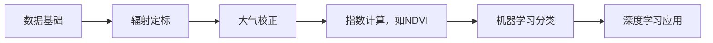
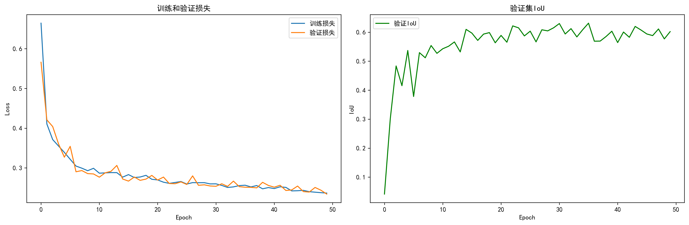

# 遥感学习项目

这是一个遥感练习项目，旨在通过实践学习 GitHub🐙💻 和遥感技术🌐

**技术栈:** `Python`, `GDAL`, `NumPy`, `Matplotlib`, `sklearn`, `svm`

---

## 学习路径 🗺️

---

## 目录 📖

1. [01-Foundation](#01-foundation)
   - [01-Raster-IO-with-GDAL](#01-raster-io-with-gdal)
   - [02-Raster-Processing-with-GDAL](#02-raster-processing-with-gdal)
   - [03-NDVI-Calculation](#03-ndvi-calculation)
2. [02-Machine-Learning](#02-machine-learning)
   - [01-Image-Classification-SVM](#01-image-classification-svm)
3. [03-Deep-Learning](#03-deep-learning)
   - [01-UNet-Building-Extraction](#01-unet-building-extraction)

---

## 01-Foundation

### 01-Raster-IO-with-GDAL

**目标：** 熟悉遥感栅格数据的基本结构，掌握使用GDAL库进行数据读取和简单的处理。

**数据源：** Landsat 9 L1TP数据，(path: 121/row: 40)，获取自 [USGS Earth Explorer](https://earthexplorer.usgs.gov/)

**结果与讨论：**

- 成功完成了真彩色图像的和成，但未进行大气校正，图像雾霾感较重
- 简单的进行了NDVI处理，但没有处理nan和除零的情况

| 真彩色合成 | 简单的NDVI处理 |
|:------------:|:------------:|
|  |  |

---

### 02-Raster-Processing-with-GDAL

**目标：** 掌握遥感栅格数据的预处理，特别是大气校正

**结果与讨论：**

- 深刻理解了遥感数字数值（DN）与物理量（反射率、辐亮度）之间的区别

- 基本完成了大气校正，但是预期的黑暗像元法(DOS)未完成，最小辐亮度`Lmin`以0.0代替

- 计划通过 **中值滤波引导** 的方法，先对辐亮度图像进行中值滤波平滑噪声，找到最暗点的坐标，再于**原始图像**上该点周围取一个小窗口，计算其中位数作为`Lmin`，但在实际运行过程中发现最暗点预选部分运行较慢，且频繁追踪云的位置，需要进行改善和优化

**校正效果:**

- 图像整体整体更清晰，雾霾感降低（见对比图）

| 大气校正前 | 大气校正后 |
|:------------:|:------------:|
| | |

---

### 03-NDVI-Calculation

**目标：** 使用大气校正后的数据计算NDVI，并处理了nan和分母为零的情况

**结果与讨论：**

- 由于图像经过了大气校正，结果更加准确（见对比图）

- 发现在部分水体中存在NDVI值较高的情况，通过对比真彩色图像和查找地图发现，该区域存在一个湿地保护区，推测是区内水体的大量水生植物反射近红外光导致NDVI值升高

| 大气校正前（表观反射率） | 大气校正后（地表反射率） |
|:------------:|:------------:|
| | |

---

## 02-Machine-Learning

### 01-Image-Classification-SVM

**目标：** 学习使用qgis等工具学习样本标注和构建数据集，并通过训练svm完成分类任务

**结果与讨论：**

- 由于原始图像的分辨率较低和标注的准确率较低，模型效果不佳，考虑使用公开数据集进行训练

- 使用了新的标注方法，模型准确率提高，但在对部分类型(如常将水体混淆为房屋)预测效果依旧不佳

- | class | precision | recall | f1-score | support |
   |:------------:|:------------:|:------------:|:------------:|:------------:|
   | 0.0（水体） | 0.97 | 0.85 | 0.91 | 1732 |
   | 1.0（森林） | 0.99 | 1.00 | 1.00 | 2132 |
   | 2.0（农田） | 0.80 | 0.64 | 0.71 | 146 |
   | 3.0（房屋） | 0.58 | 0.88 | 0.70 | 565 |
   | 4.0（裸地） | 0.77 | 0.69 | 0.73 | 269 |
   | 5.0（湿地） | 0.97 | 0.91 | 0.94 | 397 |
   | accuracy | | | 0.90 | 5241 |
   | macro avg | 0.85 | 0.83 | 0.83 | 5241 |
   | weighted avg | 0.92 | 0.90 | 0.91 | 5241 |

| 原始图像 | 分类图像 |
|:------------:|:------------:|
|||

---

## 03-Deep-Learning

### 01-UNet-Building-Extraction

**目标：** 学习UNet模型并训练使用UNet模型进行建筑物识别

**结果与讨论：**

- 由于原数据分辨率较低，接下来的项目将通过[dd-ml-segmentation-benchmark](https://github.com/dronedeploy/dd-ml-segmentation-benchmark)的数据集进行

| 训练过程 |
|:------------:|
|  |

| 推理效果 |
|:------------:|
|  |

---

## 关于我

⭐ 学艺不精，欢迎提出建议看法 ❤️

---
